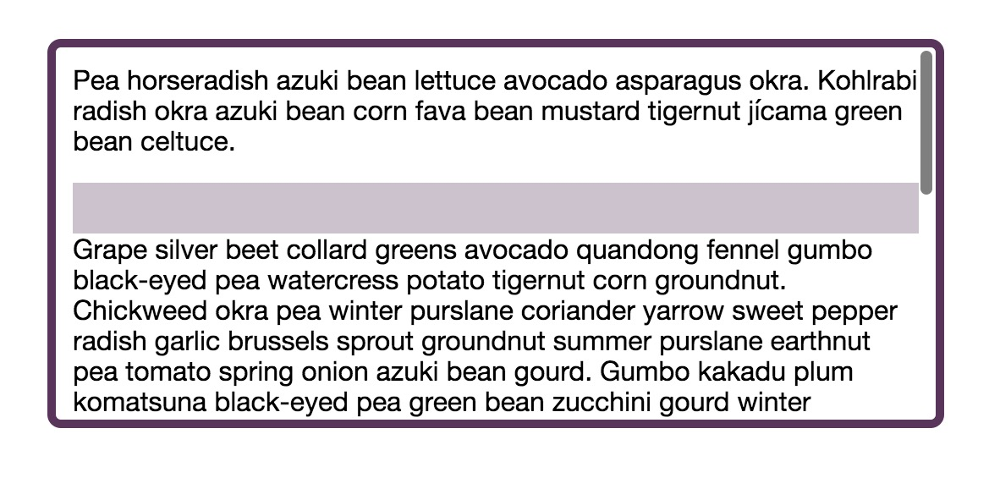
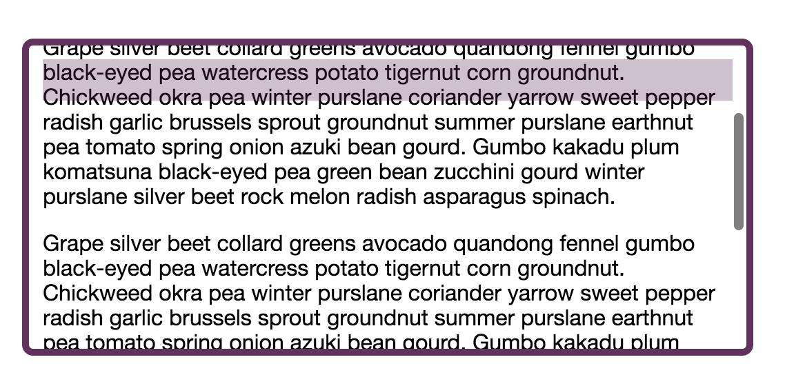

### 功能
设置position: sticky会让元素在页面滚动时如同在正常流中，但当其滚动到相对于视口的某个特定位置时就会固定在屏幕上，如同fixed一般。这个属性值是一个较新的CSS属性，在浏览器兼容性上会差一些，但在不兼容的浏览器中会被忽略并会退到正常的滚动情况。

### demo
demo展示效果是导航栏会随着页面滚动，而当导航栏滚动到页面顶部时则会固定在顶部位置。

### 效果图
滚动之前:
 

滚动之后的吸顶效果:
 
